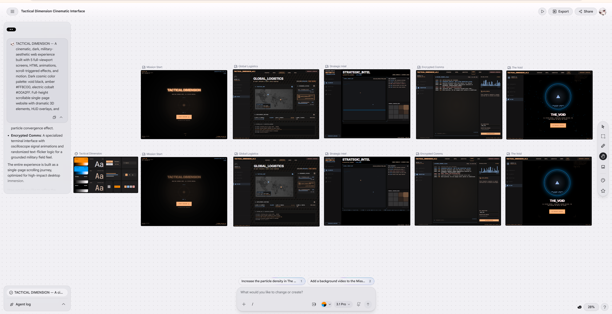
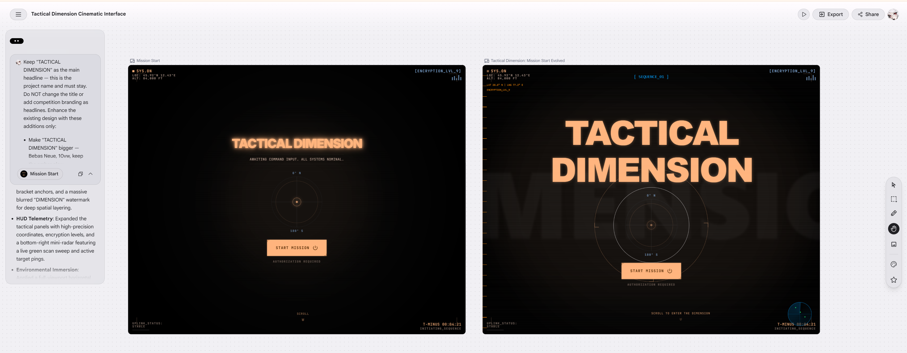
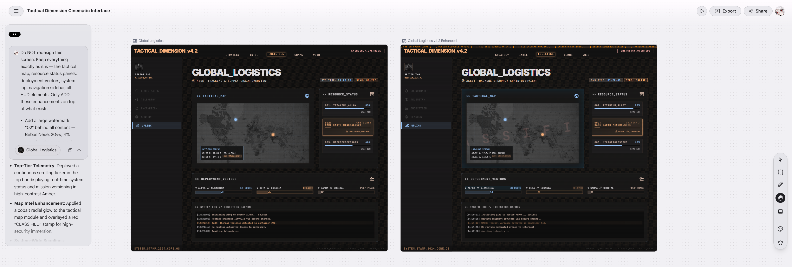
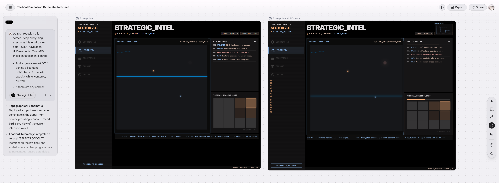
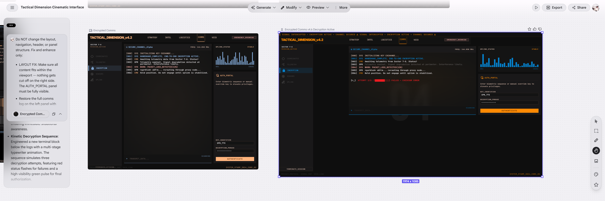
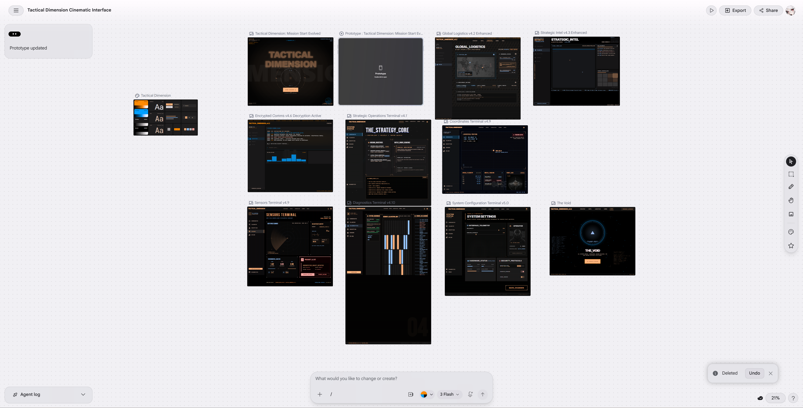

<div align="center">

```
████████╗ █████╗  ██████╗████████╗██╗ ██████╗ █████╗ ██╗
╚══██╔══╝██╔══██╗██╔════╝╚══██╔══╝██║██╔════╝██╔══██╗██║
   ██║   ███████║██║        ██║   ██║██║     ███████║██║
   ██║   ██╔══██║██║        ██║   ██║██║     ██╔══██║██║
   ██║   ██║  ██║╚██████╗   ██║   ██║╚██████╗██║  ██║███████╗
   ╚═╝   ╚═╝  ╚═╝ ╚═════╝   ╚═╝   ╚═╝ ╚═════╝╚═╝  ╚═╝╚══════╝

██████╗ ██╗███╗   ███╗███████╗███╗   ██╗███████╗██╗ ██████╗ ███╗   ██╗
██╔══██╗██║████╗ ████║██╔════╝████╗  ██║██╔════╝██║██╔═══██╗████╗  ██║
██║  ██║██║██╔████╔██║█████╗  ██╔██╗ ██║███████╗██║██║   ██║██╔██╗ ██║
██║  ██║██║██║╚██╔╝██║██╔══╝  ██║╚██╗██║╚════██║██║██║   ██║██║╚██╗██║
██████╔╝██║██║ ╚═╝ ██║███████╗██║ ╚████║███████║██║╚██████╔╝██║ ╚████║
╚═════╝ ╚═╝╚═╝     ╚═╝╚══════╝╚═╝  ╚═══╝╚══════╝╚═╝ ╚═════╝ ╚═╝  ╚═══╝
```

# TACTICAL DIMENSION v4.2

**A 10-screen cinematic military HUD interface — built entirely with Google Stitch**

[](https://stitch.withgoogle.com)
[](https://tactical-dimension.netlify.app/)
[](https://contra.com)
[](LICENSE)

<br/>

> *"Interfaces that feel alive"* — Google Stitch Challenge Theme

<br/>

### 🔗 LIVE DEMOS

| Version | Link | Description |
|---|---|---|
| 🚀 **Main Prototype** | [tactical-dimension.netlify.app](https://tactical-dimension.netlify.app/) | Full boot experience + all 10 screens |
| 🤖 **Google AI Build** | [tactical-dimension-googleai.netlify.app](https://tactical-dimension-googleai.netlify.app/) | Built via Google AI Studio integration |

</div>

---

## 📹 WALKTHROUGH VIDEOS

<table>
<tr>
<td width="50%" align="center">

### 🎬 Stitch Prototype Walkthrough
[](https://drive.google.com/file/d/12oxkqIrFm0p-VrvDjromweBEnT-R5kZ2/view?usp=sharing)

*Full canvas walkthrough — showing the Stitch build process, all 10 screens, streaming generation and in-place edits in action*

</td>
<td width="50%" align="center">

### 🌐 Deployed Site Walkthrough
[](https://drive.google.com/file/d/1hr1E8HXAEtqktFEmE8FxP9zvrULjrZ3z/view?usp=sharing)

*Live deployed prototype — boot sequence, navigation, all screens, transitions and motion in the browser*

</td>
</tr>
</table>

---

## 🖥️ SCREENSHOTS

### Canvas Overview — Full Build

*All 10 screens visible on the Stitch canvas — the complete tactical world at a glance*

---

### The Iteration Process

| Initial Generation | First Refinement |
|---|---|
|  |  |
| *First prompt output — dark tactical base generated* | *In-place edits: targeting rings, HUD overlays added* |

| Deep Refinement | Polish Pass |
|---|---|
|  |  |
| *Amber glow, radar, scanlines, corner brackets* | *Final motion pass — animations and transitions locked* |

---

### Final Canvas


*Final canvas — 10 screens, consistent design system, ready for export*
---

## 🎯 WHAT IS TACTICAL DIMENSION

TACTICAL DIMENSION is a cinematic military HUD interface inspired by the dark, tactical aesthetic of COD MW3. It is a fully interactive 10-screen prototype that demonstrates what AI-native interface building looks like when pushed to its limits.

Every screen was **generated, iterated, and refined entirely inside Google Stitch** — from a single descriptive prompt to a fully deployed prototype.

### The 10 Screens

| # | Screen | Description |
|---|---|---|
| 01 | **MISSION START** | Hero entry — targeting rings, HUD overlays, boot sequence |
| 02 | **GLOBAL LOGISTICS** | Tactical map, resource tracking, deployment vectors |
| 03 | **STRATEGIC INTEL** | Threat analysis, telemetry feed, live data panels |
| 04 | **ENCRYPTED COMMS** | Secure channel log, live decryption animation, auth portal |
| 05 | **STRATEGY CORE** | Mission strategy dashboard, objective tracking |
| 06 | **COORDINATES TERMINAL** | GPS and coordinate system, location tracking |
| 07 | **SENSORS TERMINAL** | Environmental sensors, threat detection grid |
| 08 | **DIAGNOSTICS** | System diagnostics, performance monitoring |
| 09 | **SYSTEM CONFIGURATION** | Settings, hardware status, security protocols |
| 10 | **THE VOID** | Mission end state — dimensional lock acquired |

---

## 🎨 DESIGN SYSTEM

```
COLORS
──────────────────────────────────────
Void Black    #02040E   Background
Amber         #FF8C00   Primary accent, headlines, HUD elements
Cobalt        #00A2FF   Secondary accent, data labels, tech elements
Pure White    #FFFFFF   Body text, key information
Alert Red     #FF2020   Warnings, critical states

TYPOGRAPHY
──────────────────────────────────────
Bebas Neue    Headlines, screen titles, large display text
Space Mono    Data labels, HUD text, terminal output, captions

MOTION
──────────────────────────────────────
Scanlines     Repeating 1px horizontal lines, 1.5% opacity
Targeting     Counter-rotating dashed rings with L-bracket markers
Ticker        Infinite horizontal scroll, amber 50% opacity
Boot Sequence Typewriter log + amber progress bar
Transitions   Dark flash overlay between screen switches
```

---

## 🏗️ PROJECT STRUCTURE

```
tactical-dimension/
│
├── 📁 tactical-dimension/              ← Google AI Studio version
│   
├── 📁 stitch_tactical_dimension/       ← Individual screen exports from Stitch
│   ├── 01-mission/
│   ├── 02-logistics/
│   ├── 03-intel/
│   ├── 04-comms/
│   ├── 05-strategy/
│   ├── 06-coordinates/
│   ├── 07-sensors/
│   ├── 08-diagnostics/
│   ├── 09-sysconfig/
│   └── 10-void/
│
├── 📁 screenshots/                  ← All 6 build screenshots
│
└── 📄 PROMPTS.md                    ← All Stitch prompts used (prompt engineering)
```

---

## ⚙️ HOW IT WAS BUILT — THE STITCH WORKFLOW

### 1. Streaming Generation
Started with a single detailed prompt describing the full tactical vision — dark military aesthetic, amber/cobalt color system, HUD overlay style. Stitch streamed the complete interface directly to canvas, generating all 5 initial screens simultaneously.

### 2. In-Place AI Edits
Each screen went through 2-4 rounds of in-place refinement using Stitch's point-and-click edit feature. Key rule: every prompt started with *"Keep everything exactly as is — only ADD..."* to preserve the existing design while layering enhancements.

### 3. Iteration Strategy
The canvas showed all screens side by side. Old and new versions of each screen appeared together, making it easy to compare and decide. This visual diff workflow is unique to Stitch and dramatically speeds up decision-making.

### 4. Export + Deploy
Each screen exported individually via Stitch's Netlify integration. All 10 screens then connected through a master `index.html` with boot sequence, navigation, keyboard controls, and cinematic transitions.

---

## 🚀 RUNNING LOCALLY

```bash
# Clone the repo
git clone https://github.com/NDDimension/tactical-dimension.git
cd tactical-dimension

# Open with Live Server (VS Code extension)
# Right-click index.html → Open with Live Server

# Or use npx
npx live-server
```

Then open `http://localhost:8080` in your browser.

---

## 🏆 SUBMISSION

This project was submitted to the **Google Stitch Challenge on Contra** (June 2026).

**Challenge Theme:** *Build interfaces that feel alive*

**Stitch Features Used:**
- ✅ Streaming generations directly to canvas
- ✅ In-place AI edits using prompts and point-and-click
- ✅ Native motion, animation, and hover states on HTML canvas
- ✅ Export/deploy via Netlify integration
- ✅ Iterative workflow from existing screens

---

## 📄 LICENSE

MIT License — feel free to use the code, just don't use the TACTICAL DIMENSION brand for commercial purposes.

---

<div align="center">

**[ TACTICAL DIMENSION — SYSTEM_STAMP_2026 ]**

*Built with ❤️ and Google Stitch*

[](https://stitch.withgoogle.com)
[](https://contra.com)

</div>
